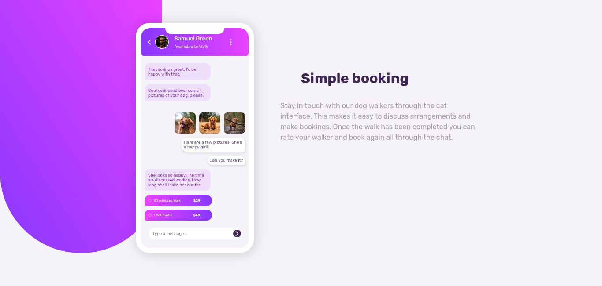
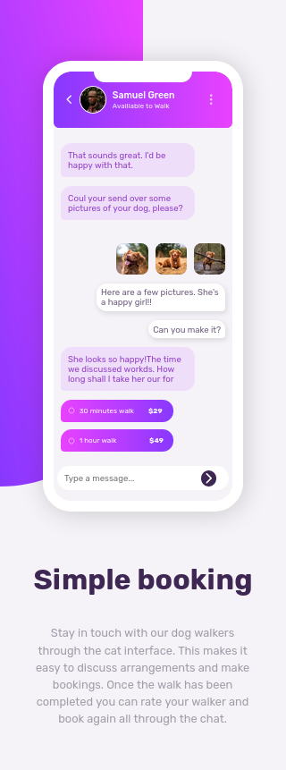

# Frontend Mentor - Solución a Chat app CSS illustration

Esta es una solución al [Desafío de Chat app CSS illustration en Frontend Mentor](https://www.frontendmentor.io/challenges/chat-app-css-illustration-O5auMkFqY).

## Tabla de contenido

- [Visión general](#visión-general)
  - [El reto](#el-reto)
  - [Capturas de pantalla](#capturas-de-pantalla)
  - [Enlaces](#enlaces)
- [Mi proceso](#mi-proceso)
  - [Construido con](#construción)
  - [Lo que aprendi](#lo-que-aprendi)
  - [Desarrollo continuo](#desarrollo-continuo)
  - [Recursos útiles](#recursos-útiles)
- [Autor](#autor)

## Visión general

### El reto

Los usuarios deben ser capaces de:

- Ver el diseño óptimo en función del tamaño de la pantalla de su dispositivo
- Ver los estados hover de los elementos interactivos

### Capturas de pantalla

- Escritorio

- Movil

### Enlaces

- URL de la solución (Frontend Mentor): [Solución en Frontend Mentor](https://www.frontendmentor.io/solutions/flexbox-transitions-responsive-accessibility-XSNVolZFYM)
- URL del sitio en vivo: [En vivo](https://boudgnosis.github.io/chat-app-landing-page/)

## Mi Proceso

### Construción

- HTML semántico
- Variables CSS
- Flexbox
- Accesibilidad web
- Media queries
- Responsive desing
- Efectos hover
- Loanding (HTML5)
- Desktop first

### Recursos útiles

- [MDN Web Docs](https://developer.mozilla.org/es/) - Suelo usar este recurso porque explica muy bien todo además de que tiene una documentación muy amplia.

- [IONICONS](https://ionic.io/ionicons) - Es una página de iconos bastante sencilla de usar.

- [Google Fonts](https://fonts.google.com/) - Multiples fuentes para poder usar.

## Autor

- Codepen - [@boudgnosis](https://codepen.io/boudgnosis)
- Frontend Mentor - [@boudgnosis](https://www.frontendmentor.io/profile/boudgnosis)
- Twitter - [@juan_ariasd](https://twitter.com/juan_ariasd)
- Dev - [@juan_duque](https://dev.to/juan_duque)
- Linkedink - [juan pablo arias duque](https://www.linkedin.com/in/jpariasduque/)
